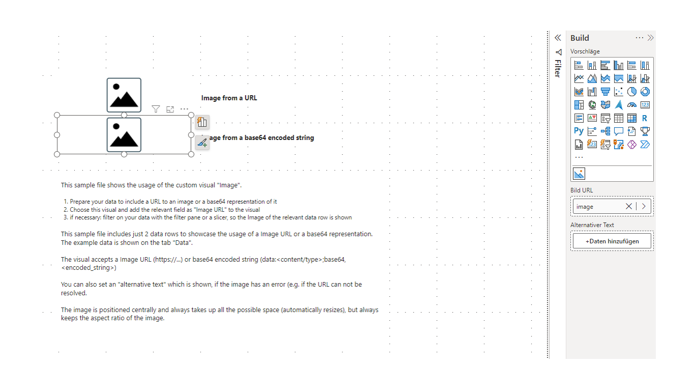

# Custom Power BI visual - Image

A custom Power BI visual to show an **Image** from a String representing a URL or base64 encoded Image

- automatically adjusts to the aspect ratio when resizing
- allows image URLs or base64 encoded images

## Usage

Just import the visual definition file (see **dist Folder**) and enjoy :)

## Example

Download the example Power BI file and explore >> [image.pbix](sample/image.pbix)

